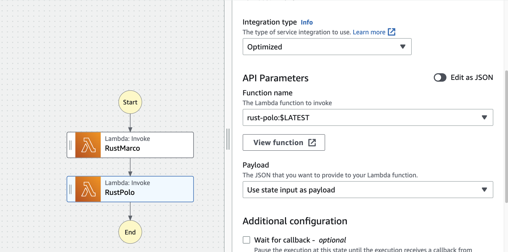
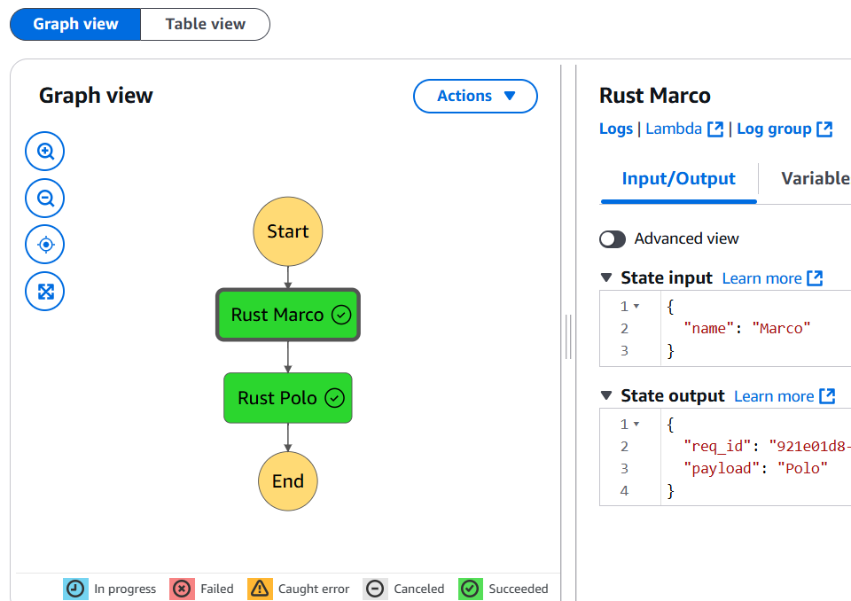

# Rust AWS Step Functions Pipeline

The purpose of this module is to build step functions from AWS using Rust. Step functions are very powerful serverless workflows that can be used to orchestrate complex tasks. These tasks can be chained together, where the input of one lambda function is used as the input to another lambda function. By using these principles one can create very complex workflows.

We create new marco polo lambda by running:

```
cargo lambda new rust-marco
```

Then build, deploy and invoke:

```
make release
make deploy
make invoke
```

Then we create a new rust polo lambda by running:

```
cargo lambda new rust-polo
```



The state input and output at each stage can also be viewed:


## Prerequisites

- [Rust](https://www.rust-lang.org/tools/install)
- [Cargo Lambda](https://www.cargo-lambda.info/guide/installation.html)

You may get an error if Zig is not installed. cargo-lambda uses Zig and cargo-zigbuild to compile the code for the right architecture. I'm working in GitHub codespaces, so I need to install the vscode-zig extension (installs zig and zls) and put the zig install location in PATH:

```
echo 'PATH="$PATH:/home/codespace/.vscode-remote/data/User/globalStorage/ziglang.vscode-zig/zig_install"' >>~/.profile
```

Restarting the codespace and source ~/.profile to make sure zig stays in PATH.

You can install cargo-zigbuild by running:

```
cargo install --locked cargo-zigbuild
```

## Building

To build the project for production, run `cargo lambda build --release`. Remove the `--release` flag to build for development.

Read more about building your lambda function in [the Cargo Lambda documentation](https://www.cargo-lambda.info/commands/build.html).

## Testing

You can run regular Rust unit tests with `cargo test`.

If you want to run integration tests locally, you can use the `cargo lambda watch` and `cargo lambda invoke` commands to do it.

First, run `cargo lambda watch` to start a local server. When you make changes to the code, the server will automatically restart.

Second, you'll need a way to pass the event data to the lambda function.

You can use the existent [event payloads](https://github.com/awslabs/aws-lambda-rust-runtime/tree/main/lambda-events/src/fixtures) in the Rust Runtime repository if your lambda function is using one of the supported event types.

You can use those examples directly with the `--data-example` flag, where the value is the name of the file in the [lambda-events](https://github.com/awslabs/aws-lambda-rust-runtime/tree/main/lambda-events/src/fixtures) repository without the `example_` prefix and the `.json` extension.

```bash
cargo lambda invoke --data-example apigw-request
```

For generic events, where you define the event data structure, you can create a JSON file with the data you want to test with. For example:

```json
{
  "command": "test"
}
```

Then, run `cargo lambda invoke --data-file ./data.json` to invoke the function with the data in `data.json`.

Read more about running the local server in [the Cargo Lambda documentation for the `watch` command](https://www.cargo-lambda.info/commands/watch.html).
Read more about invoking the function in [the Cargo Lambda documentation for the `invoke` command](https://www.cargo-lambda.info/commands/invoke.html).

## Deploying

To deploy the project, run `cargo lambda deploy`. This will create an IAM role and a Lambda function in your AWS account.

Read more about deploying your lambda function in [the Cargo Lambda documentation](https://www.cargo-lambda.info/commands/deploy.html).
